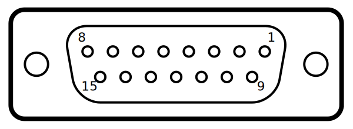

# Configuring charging system for Drone Port

## Additional components
Components required for building the interface (Mouser codes):
- Cable D-Sub kabel DB15M/F  CS-DSDMDB15MF-005 For droneport interface only female is neded (charger side)[^1].
- Header for source board (2x22, 44pins): 7-534206-2 header & wire housing 2x22p

## Add drone port config to the config file
To enable Drone port the GPIO section needs to be added to the skycharge config file.
Login remotly to a charging system with ssh and edit the file:
```bash
nano /etc/skycharge.conf
```

on the bottom add lines:

```bash
#
# DronePort configuration
#

dp-hw-interface          = gpio
dp-is-closed-pin         = P8.07  # gpio66
dp-in-progress-pin       = P8.08  # gpio67
dp-is-drone-detected-pin = P8.09  # gpio69
dp-is-opened-pin         = P8.10  # gpio68
dp-open-pin              = P8.11  # gpio45
dp-close-pin             = P8.12  # gpio44
dp-is-landing-err-pin    = P8.13  # gpio23
dp-is-ready-pin          = P8.14  # gpio26
````

Detailed description of the config can be found [here](https://support.skycharge.de/docs/configuration-file)
To test run:
```bash
skycharge-cli show-droneport-state
```

## wireing the interface
Charging system side provides D-SUB 15 female plug.




| Beaglebone interface  | Beaglebone gpio pin| Cable color [^1] | D-SUB pin    | D-SUB connector            |
| --------------------- | ------------------ | ----------- | ----------- | --------------------------- |
| dp-is-closed-pin      |    gpio66          | <span style="background-color: gray">-----</span> |pin 9        | Gate is close (3.3v, status)            |
| dp-in-progress-pin    |    gpio67          | <span style="background-color: white">-----</span> |pin 10       | Gate is opening/closing (3.3v, status)  |
| dp-is-drone-detected-pin| gpio69  |<span style="background-color: black">--</span>/<span style="background-color: white">--</span>| pin 13 | Drone on the pad  |
| dp-is-opened-pin | gpio68 | <span style="background-color: purple">-----</span> | pin 8 | Gate is open (3.3v, status)   |
| dp-open-pin  | gpio45 | <span style="background-color: red">-----</span> | pin 3 | Open gate (3.3v, >=100mS)  |
| dp-close-pin | gpio44 | <span style="background-color: orange">-----</span> | pin 4 | Close gate (3.3v, >=100mS)  |
| dp-is-landing-err-pin | gpio23 |  | NC |   |
| dp-is-ready-pin | gpio26 | <span style="background-color: lightgreen">-----</span>  | pin 12 | Automa􏰀on in auto and ready (3.3v, status)  |


[^1]: For cable CS-DSDMDB15MF-005 from Mouser, this is extension cable, cut in half female part used for interface, male part used for tester. For future orders female-female cable should be ordered.