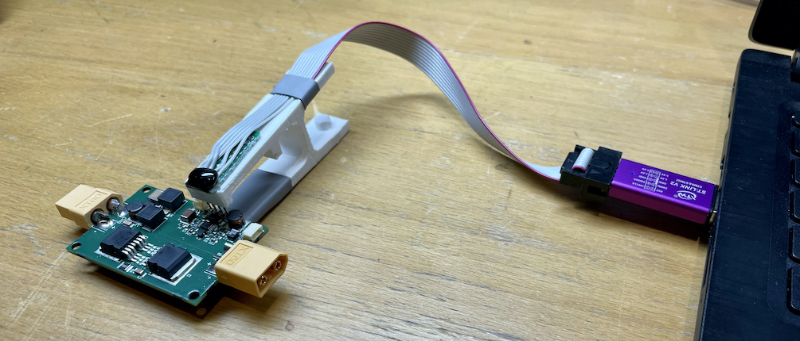

# Flashing PLC

## Connecting programmer

Connect the ST-link USB dongle (programmer) to a USB port and clip the PLC board.

!!! Warning

        The clip pin order works ONLY with the sink PLC ver 1.0.3 older version have diferent pins order and need to be wire manually, the clip can not be used.

Fro flashin 4 wires need to be connected from programmer to PLC only:
 
 - 3V3
 - GND
 - CLK
 - DIO
  


## Flashing the firmware 

To flash the connected sink PLC run from /devel/skycharge/hw2/skysink/firmware:
```bash
make flash-hw-version HW_VERSION=1.3.0
```

## Other usefull commands
```bash
st-info —probe
```
