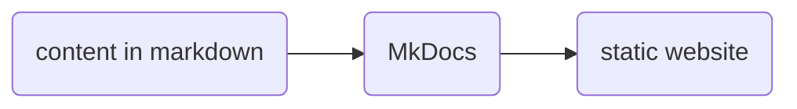
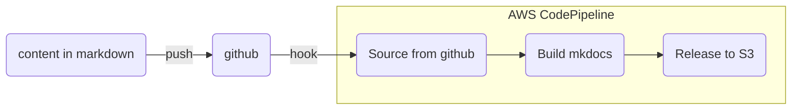
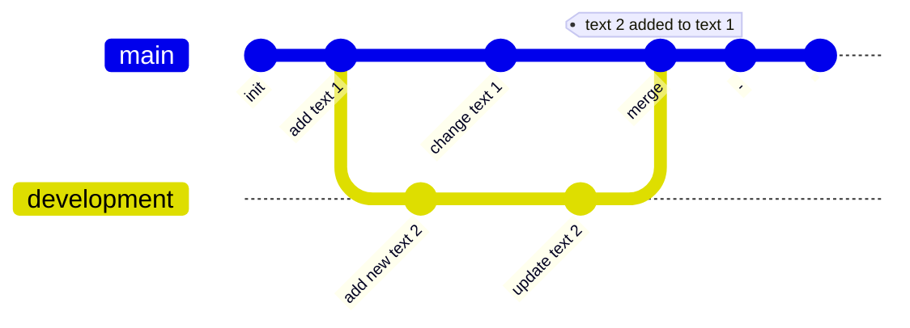
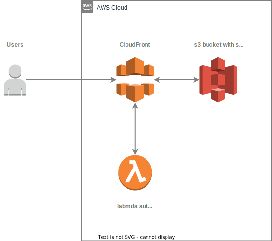

# Documentation system

## Assumptions

- easy to write in, edit, focus on content to make the knowledge transfer easy
- to use open standards like markdown and json, platform independent language
- the content is decoupled from code and can be used with various tools, frameworks to generate document
- searchable, easly render to static webpage, pdf
- version control for colaboration and tracking mistakes and bugs
- staging with previewing before publishing
- host enywhere, i.e github, s3 etc
- open source, no subscription nor dependecies from 3rd party apps including graphs, charts and diagrams

## Tools chosen for creating this document:
<!-- TODO open link in a new page add {:target="_blank"} -->
- [MkDocs](https://www.mkdocs.org) - the static-site generator
- [MkDOcs Material](https://squidfunk.github.io/mkdocs-material/) - to make the documentation look good
- [diagrams.net](https://www.diagrams.net) - a free online diagram editor, export to svg

## Introduction
The documentation is written in markdown. Markdown is a lightweight markup language for creating formatted text using a plain-text editor. It doesn’t do anything fancy like change the font size, color, or type — just the essentials, using keyboard symbols you already know. The markdown content is processsed by MkDocs to generate a static site.



## Local installation
Installation of mkdocs on local machine so you can edit the docs code and preview it locally without publishing.
Not neccecery but helpful if editing the documentation often. For sporadic minor changes github can be used.

### Requirements
Python with packages manager
```bash
python3 --version
python3 -m pip –version
```
If the pip is missing download it by running the following command:
```bash
curl https://bootstrap.pypa.io/get-pip.py -o get-pip.py
```

Install the downloaded package by running:
```bash
python3 get-pip.py
```
To verify that you have installed pip correctly, check the pip version on your system:
```bash
pip3 --version
```

### Installing MkDocs
```bash
pip3 install mkdocs
```
check
```bash
pip3 list | grep mkdocs
python3 -m mkdocs
```

<!-- Add to PATH
PATH='/Users/production/Library/Python/3.8/bin'
export PATH -->

```bash
pip3 install -r mkdocs-material
pip3 install mkdocs-material-extensions
```

### Using MkDocs
in terminal in project folder run:
```bash
python3 -m mkdocs serve
```
### Other commands

* `mkdocs new [dir-name]` - Create a new project.
* `mkdocs serve` - Start the live-reloading docs server.
* `mkdocs build` - Build the documentation site.
* `mkdocs -h` - Print help message and exit.

## Building from scratch
The internal documantaion project is already created. In case you need to bulid it from scratch:
Create a new repository at github where we deploy the documentation, recommended setup: 
- gitignore for python
- MIT licence
- add README.md

Once created, clone localy on your machine.

create requirments.txt (not esential but good practise) with one line mkdocs-material
```bash
"mkdocs-material" > requirments.txt
```
create enviroment (list of comannds below can be put into one script)
```bash
export _VERSION_=3.8
conda create --prefix ./env python=${_VERSION_} -y
source activate ./env
pip install -r requirements.txt
```
After the installation you can create the site:
```bash
mkdocs new
```
the nactivate the enviroment:
```bash
conda activate ./env
```

More info how to getting started at [Material for MkDocs](https://squidfunk.github.io/mkdocs-material/getting-started/)

## Publishing static webpage
When content changes are pushed to github repository, building action is automaticly triggered.
The build oprocess is done with AWS CodePipeline service, which is connected to github with hooks.



Every time a content or changes are pushed to master branch, it triggers the build flow and publish the static generated page. 
Changes on development branch, i.e adding and working on text 2, will not triger the build flow and changes will be visible only locally. After merging with master branch, text 1 with additional text 2 will be published.


## Hosting documentation website
The static website is hosted on AWS. The documentation web files are stored in S3 bucket - internaldoc.skycharge.de. The bucket is not public.
All AWS resources used for internal documentation are tagged with project name:
```json
 { "Project": "internaldoc" }
```
The tag can be used to list, filter and find cost asosiated with the internal documentation project.
CodePipeline, S3 bucket are created with Cloudformation script. Authentication via CloudFront with Lambda edge function are created manually.



### Authentication, changing password
To reset, change password, log in into [AWS console](https://aws.amazon.com), go to service Lambda, find and open the lambda-internaldoc-auth function.
In the code tab in line 8 there is the line with username and password.
```js
const authString = 'Basic ' + new Buffer('admin' + ':' + 'password').toString('base64');
```
Change, adjust if nececcery. To apply changes hit deploy.

## Files structure

The internal documentaion folder is stored in github and can be cloned and edited by multiple users.
Root folder consist configuration, docs folder consist all content documentaion pages with assets subfolder for media. aws folder consist script files for creating the pipeline.

### The project files structure:

```
internaldoc
│   mkdocs.yml       *cnfiguration file*
│   
│ 
└───aws 
│   │   s3-cf.yaml   *CloudFormation script*
│
└───docs             *content pages in md format*
│   │   index.html
│   │   page1
│   │   page2...
│   │  
│   └───assets       *media files, images etc*
│       │   logo.jpg
│       │   dp-signals.jpg
│       │   ...
```


