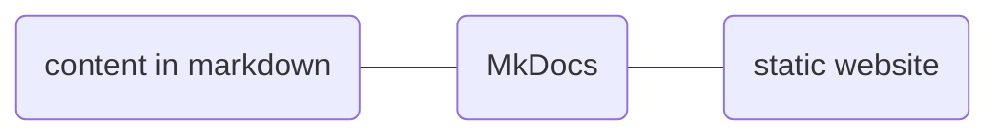
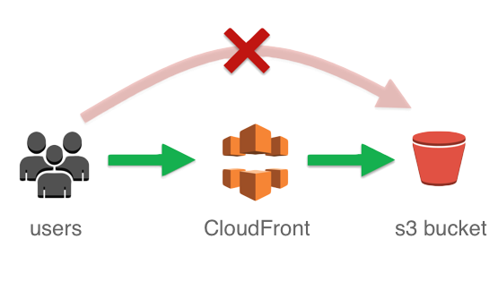
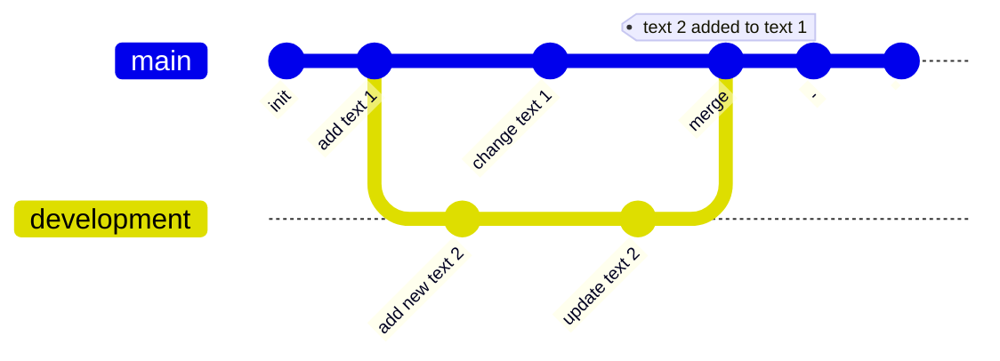

# Documentation system

## Assumptions
- easy to write in, edit, focus on content to make the knowledge transfer easy
- to use open standards like markdown and json, platform independent language
- the content is decoupled from code and can be used with various tools, frameworks to generate document
- searchable, easly render to static webpage, pdf
- version control for colaboration and tracking mistakes and bugs
- staging with previewing before publishing
- host enywhere, i.e github, s3 etc
- open source, no subscription nor dependecies from 3rd party apps

## Tools chosen for creating this document:
- [MkDocs](https://www.mkdocs.org) - the static-site generator
- [MkDOcs Material](https://squidfunk.github.io/mkdocs-material/) - to make the documentation look good
<!-- TODO add {:target="_blank"} -->

<!-- ## Todo list
- [ ] add step by step instruction to set the mkdosc + material up
- [ ] test autodeployment to s3
- [ ] copy some skycharge docs for reference
- [X] test mermaid and others adds on -->

## Introduction
The documentation is written in markdown. Markdown is a lightweight markup language for creating formatted text using a plain-text editor. It doesn’t do anything fancy like change the font size, color, or type — just the essentials, using keyboard symbols you already know. The markdown content is processsed by MkDocs to generate a static site.

<!-- TODO update aws CodePipeline -->



## Local installation
Installation of mkdocs on local machine so you can edit the docs code and preview it locally without publishing.
Not neccecery but helpful if editing the documentation often. For sporadic minor changes github can be used.

### Requirements
Python with packages manager
```shel
python3 --version
python3 -m pip –version
```
If the pip is missing download it by running the following command:
```shel
curl https://bootstrap.pypa.io/get-pip.py -o get-pip.py
```

Install the downloaded package by running:
```shel
python3 get-pip.py
```
To verify that you have installed pip correctly, check the pip version on your system:
```shel
pip3 --version
```

### Installing MkDocs
```shel
pip3 install mkdocs
```
check
```shel
pip3 list | grep mkdocs
python3 -m mkdocs
```shel

<!-- Add to PATH
PATH='/Users/production/Library/Python/3.8/bin'
export PATH -->

```shel
pip3 install -r mkdocs-material
pip3 install mkdocs-material-extensions
```

### Using MkDocs
in terminal in project folder run:
```shel
python3 -m mkdocs serve
```

## Building from scratch

Create a new repository at github where we deploy the documentation, recommended setup: 
- gitignore for python
- MIT licence
- add README.md

Once created, clone localy on your machine.

create requirments.txt (not esential but good practise) with one line mkdocs-material
```bash
"mkdocs-material" > requirments.txt
```
create enviroment (list of comannds below can be put into one script)
```bash
export _VERSION_=3.8
conda create --prefix ./env python=${_VERSION_} -y
source activate ./env
pip install -r requirements.txt
```
After the installation you can create the site:
```bash
mkdocs new .
```
the nactivate the enviroment:
```bash
conda activate ./env
```

More info how to getting started at [Material for MkDocs](https://squidfunk.github.io/mkdocs-material/getting-started/)

## Commands on local machine with the MkDocs

* `mkdocs new [dir-name]` - Create a new project.
* `mkdocs serve` - Start the live-reloading docs server.
* `mkdocs build` - Build the documentation site.
* `mkdocs -h` - Print help message and exit.

## Publishing static webpage
The documentation structure, files and media are stored on github and website building proces is automated with a github hooks.
Every time a content or changes are pushed to master branch, static site building action is automaticly triggered on AWS CodePieline and the website is generated and uploaded to AWS S3. The S3 has public access blocked. The website can be accessed via CloudFront. Authorisation is done with Lambda function.



Tests, drafts etc can be edited in other branches i.e development.
Changes on development branch, i.e adding and working on text 2, will not triger the build flow and changes will be visible only locally. After merging with master branch, text 1 with additional text 2 will be published.


