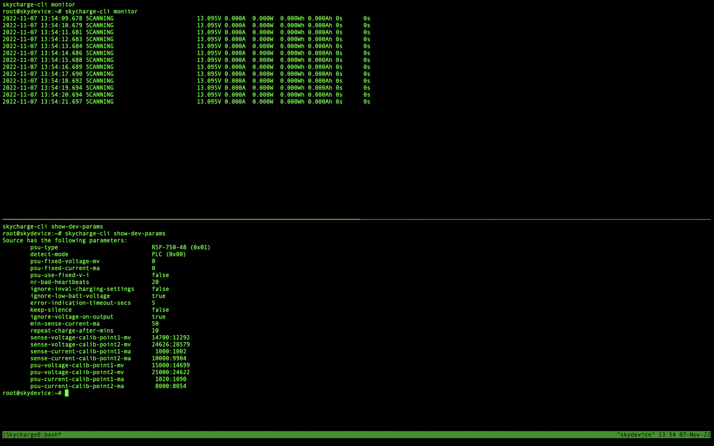

# Splitting screen in terminal
The purpose of splitting terminal screen is to see on one terminal window two panes with skycharge-cli monitor and skycharge-cli show-dev-params at the same time for demo.


## Installing tmux (if not installed)
```shell
sudo apt-get install tmux
```

## Usefull Commands list
Creat a new session (window):
```shell
tmux new -s [session_name]
```
Exit session:
```shell
exit
```
List existingrunning sessions:
```shell
tmux ls
```
Connecting to a running session
```shell
tmux attach -t 0
```


### Pane Handling
By default, the prefix is CTRL+B followed by a command.
To check the current prefix shortcut run:
```shell
tmux show-options -g | grep prefix
```

- Split panes vertically	<kbd>Ctrl</kbd> + <kbd>B</kbd> + <kbd>%</kbd>
- Split panes horizontally    <kbd>Ctrl</kbd> + <kbd>B</kbd> + <kbd>"</kbd>
- Toggle last active plane	<kbd>Ctrl</kbd> + <kbd>B</kbd> + <kbd>;</kbd>
- Swap panes	<kbd>Ctrl</kbd> + <kbd>B</kbd> + <kbd>o</kbd>
- Kill pane	<kbd>Ctrl</kbd> + <kbd>B</kbd> + <kbd>x</kbd>
- Show pane numbers	<kbd>Ctrl</kbd> + <kbd>B</kbd> + <kbd>q</kbd>
- Move plan left	<kbd>Ctrl</kbd> + <kbd>B</kbd> + <kbd>{</kbd>
- Move plan right	<kbd>Ctrl</kbd> + <kbd>B</kbd> + <kbd>}</kbd>
- Switching between panes	<kbd>Ctrl</kbd> + <kbd>B</kbd> + <kbd>arrow key</kbd>


To open a new session called Skycharge run:
```shell
tmux new -s Skycharge
```
split it horizontaly: <kbd>Ctrl</kbd> + <kbd>B</kbd> + <kbd>%</kbd>\
move between panes: <kbd>Ctrl</kbd> + <kbd>B</kbd> + <kbd>arrow key</kbd>

### Script for split and call Skycharge cli commands:

```bash
#!/bin/sh
tmux new -d -s Skycharge
tmux send -t Skycharge "skycharge-cli monitor" ENTER
tmux split-window -v
tmux send -t Skycharge.1 "skycharge-cli show-dev-params" ENTER
tmux attach -t Skycharge
```
To exit and close panes run:

<kbd>Ctrl</kbd> + <kbd>B</kbd> + <kbd>x</kbd>\
<kbd>Ctrl</kbd> + <kbd>B</kbd> + <kbd>x</kbd>
